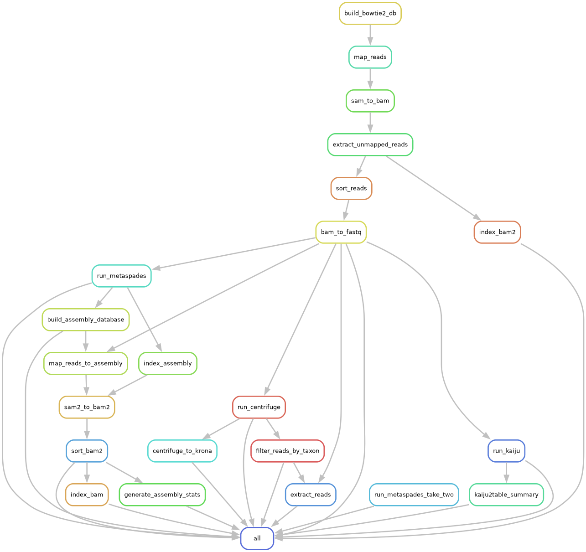

# A Snakemake Metagenomics workflow

## Introduction
A detailed metagenomics workflow for analysis Illumina reads processed from wildlife samples collected in Afar region of Ethiopia. 

### Installation
Snakemake installation (Source - Snakemake 8.11.6 documentation [https://snakemake.readthedocs.io/en/stable/getting_started/installation.html])

Snakemake is available on PyPi as well as through Bioconda and also from source code. You can use one of the following ways for installing Snakemake.

### Installation via Conda/Mamba
This is the recommended way to install Snakemake, because it also enables Snakemake to handle software dependencies of your workflow.

First, you need to install a Conda-based Python3 distribution. The recommended choice is Mambaforge which not only provides the required Python and Conda commands, but also includes Mamba an extremely fast and robust replacement for the Conda package manager which is highly recommended. The default conda solver is a bit slow and sometimes has issues with selecting the latest package releases. Therefore, we recommend to in any case use Mamba.

In case you don’t use Mambaforge you can always install Mamba into any other Conda-based Python distribution with
```
conda install -n base -c conda-forge mamba
```

### Full installation
Snakemake can be installed with all goodies needed to run in any environment and for creating interactive reports via
```
mamba create -c conda-forge -c bioconda -n snakemake snakemake
```

from the Bioconda channel. This will install snakemake into an isolated software environment, that has to be activated with
```
mamba activate snakemake
snakemake --help
```
Installing into isolated environments is best practice in order to avoid side effects with other packages.

Notes on Bioconda as a package source
Note that Snakemake is available via Bioconda for historical, reproducibility, and continuity reasons (although it is not limited to biology applications at all). However, it is easy to combine Snakemake installation with other channels, e.g., by prefixing the package name with ::bioconda, i.e.,
```
mamba activate base
mamba create -n some-env -c conda-forge bioconda::snakemake ...
```
## Project Structure overview

This project demonstrates a metagenomics analysis pipeline using Snakemake. Below you will find the main components of the pipeline.


- **DAG Visualization**: 
  

- **Pipeline Script**: 
  You can find the main pipeline script in the [Snakefile](snakefile).

## Usage
To run the pipeline, use the following command (Conda/mamba):
```
snakemake --cores 4
```
## Contributing
Please feel free to contribute to this project by submitting issues or pull requests.

## License
This project is licensed under the MIT License.

## Author

* Brian M Ogoti
* Web: [The Center for Epidemiological Modelling and Analysis CEMA](https://cema-africa.uonbi.ac.ke/people/epidemiology/brian-maina) 
* Twitter: [@diyobraz2](https://x.com/diyobraz2)


